# WellNest Scribe — Note Generation Pipeline v2

> **Version**: v2 (post June 2026 optimisations)  
> **Predecessor**: [note-generation-pipeline.md](note-generation-pipeline.md) — read it first for the full context on why GPT-5 is required and why the Patois interpreter prompt is so verbose.

---

## What Changed in v2

| Area | v1 | v2 |
|------|----|----|
| Interpret output | GPT-5 writes Steps 1, 2, and 3 in visible text (~1 500 tokens) | `SCRIBE_SLIM_INTERPRET=True`: GPT-5 reasons Steps 1 & 3 internally, only emits Step 2 (~400 tokens). Saves **5–8 s**. |
| Pipeline calls | Always 2 sequential GPT-5 calls | `SCRIBE_COMBINED_PIPELINE=True`: 1 call (interpret + SOAP in one shot). Saves **10–15 s**. |
| UX latency | Doctor waits for full note before seeing anything | `SCRIBE_STREAM_GENERATION=True`: tokens stream to browser. First text visible at **~2–3 s**. |
| Timing data | Not tracked | `ScribeSession.timings` JSONField — audio seconds, transcription ms, interpret ms, SOAP ms, total ms. |
| Admin visibility | No latency view | `/scribe/admin/latency/` — per-session pipeline timing table. |

---

## Feature Flags (`.env`)

```env
SCRIBE_SLIM_INTERPRET=True          # Opt 1 — ON by default, safe
SCRIBE_COMBINED_PIPELINE=False      # Opt 2 — off until battle-tested
SCRIBE_STREAM_GENERATION=False      # Opt 3 — off by default
```

---

## v2 Flow Diagram

```mermaid
flowchart TD
    A([Doctor presses Record]) --> B[Browser: MediaRecorder → WebM blob]
    B --> C[POST /upload-audio/\nCreates ScribeSession\nstatus=draft]
    C --> D[POST /ambient-transcribe/\nbody: backend=modal-omni]
    D --> E[Django: submit_triage_job\nspawns background thread]
    E --> F[Return immediately\njob_id to browser]
    F --> G{Browser polls\n/ambient-jobs/job_id/\nevery 2s}

    subgraph BG [Background thread]
        H[transcribe_modal_omni\nPOST to Modal GPU endpoint\nturbogary555.modal.run]
        H --> I[Model inference\nWhisper-based omniASR\nRTFx ~11x]
        I --> J[Return transcript\n+ timing stats]
        J --> K[ScribeSession.update\nraw_transcript = text\ntimings.transcription_ms = N]
        K --> L[job.stage = 'done']
    end

    D --> H
    G -- status=done --> M[Browser: got transcript\nShow timing card if Modal stats available]

    M --> N{SCRIBE_STREAM_GENERATION?}

    N -- False\ndefault --> O[POST /generate/\nBlocking — waits for full note]
    N -- True --> P[POST /generate/stream/\nSSE stream]

    subgraph GEN [generate_note_api — Two-Call Path]
        O --> Q{First generation\nor force_reinterpret?}
        Q -- Yes --> R[Call 1: run_interpret_patois\nGPT-5 — 10-15s\nv2: slim output = 7-10s]
        R --> S[_extract_step2\nGet clean clinical English]
        S --> T[ScribeSession.transcript = step2]
        Q -- No regen --> T
        T --> U[Call 2: run_note_generation\nGPT-5 — 10-20s]
        U --> V[Parse SOAP sections\nvalidate_note_safety\nSOAPNote.save]
        V --> W[ScribeSession.timings.generation_ms = N\ntimings.total_generation_ms = N\nstatus = review]
    end

    subgraph COMBINED [generate_note_api — Combined Path SCRIBE_COMBINED_PIPELINE=True]
        O2[interpret_and_generate_soap\nSingle GPT-5 call — 15-25s] --> O3[Parse ---SOAP--- separator\nStep2 = clinical_english\nSOAP = note]
        O3 --> V
    end

    subgraph STREAM [generate_note_stream_api — Option 3]
        P --> P1[Phase 1: run_interpret_patois\nBlocking wait for full interpret output]
        P1 --> P2[Phase 2: stream_note_generation\nstream=True tokens arrive as yielded]
        P2 --> P3[SSE: data chunk chunk chunk...\ndone event with review_url]
    end

    W --> X([Redirect to /sessions/pk/review/])
    P3 --> X

    style BG fill:#1a2a3a,stroke:#4a9eff
    style GEN fill:#1a3a2a,stroke:#4aff9e
    style COMBINED fill:#3a2a1a,stroke:#ff9e4a
    style STREAM fill:#2a1a3a,stroke:#9e4aff
```



---

## Timing Data Schema (`ScribeSession.timings`)

```json
{
  "audio_seconds": 324.7,
  "transcription_ms": 29800,
  "preprocess_ms": 5300,
  "inference_ms": 17080,
  "realtime_factor": 10.9,
  "interpret_ms": 9200,
  "generation_ms": 14100,
  "total_generation_ms": 23300,
  "pipeline_mode": "two-call",
  "generation_model": "gpt-5-chat"
}
```

Populated in two places:
1. `ambient_transcribe_api._run()` — writes `audio_seconds`, `transcription_ms`, `preprocess_ms`, `inference_ms`, `realtime_factor` from Modal response
2. `generate_note_api` / `generate_note_stream_api` — writes `interpret_ms`, `generation_ms`, `total_generation_ms`, `pipeline_mode`

---

## Key Code Locations

| What | File | Function/Class |
|------|------|----------------|
| Slim interpret addendum | `soap_generator.py` | `_REASONING_SLIM_ADDENDUM` + `interpret_patois()` |
| Combined call | `soap_generator.py` | `interpret_and_generate_soap()` |
| Streaming | `soap_generator.py` | `stream_note_generation()` |
| Timing tracking (generate) | `views.py` | `generate_note_api`, `generate_note_stream_api` |
| Timing tracking (transcription) | `views.py` | `ambient_transcribe_api._run()` |
| Latency admin page | `views.py` | `LatencyLogView` |
| Timings model field | `models.py` | `ScribeSession.timings` |
| Review page badge | `templates/scribe/review.html` | timing card partial |
| Nav link | `templates/partials/_nav_items.html` | latency_log url |

---

## Performance Budget (5-min consult)

| Stage | v1 | v2 two-call | v2 combined |
|-------|-----|-------------|-------------|
| Modal GPU transcription | 29.8 s | 29.8 s | 29.8 s |
| GPT-5 interpret | 12–15 s | **7–10 s** (slim) | — |
| GPT-5 SOAP generate | 10–20 s | 10–20 s | — |
| Single combined call | — | — | **15–25 s** |
| **Total wall time** | **52–65 s** | **47–60 s** | **45–55 s** |
| Perceived w/ streaming | same | same | **~3 s first text** |
